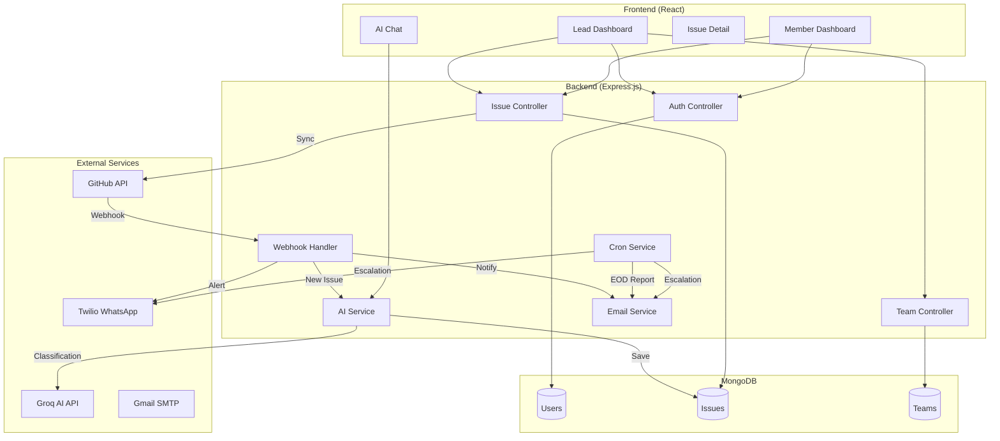
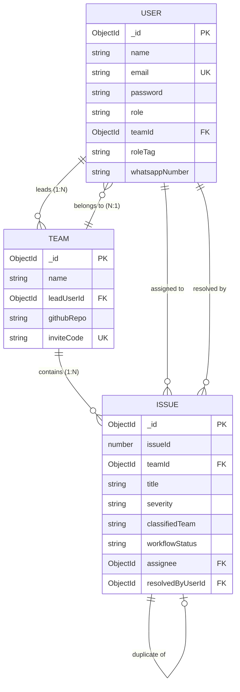

# Gitora — Technical Documentation Report

**AI-Powered GitHub Issue Management Platform**

---

## Table of Contents

1. [Project Overview](#1-project-overview)
2. [System Architecture](#2-system-architecture)
3. [Database Schema](#3-database-schema)
4. [API Documentation](#4-api-documentation)
5. [AI Severity Classification](#5-ai-severity-classification)
6. [Notification System](#6-notification-system)
7. [GitHub Integration Details](#7-github-integration-details)
8. [Frontend Structure](#8-frontend-structure)
9. [Tech Stack Summary](#9-tech-stack-summary)
10. [Setup / Deployment](#10-setup--deployment)
11. [Limitations / Future Work](#11-limitations--future-work)

---

## 1. Project Overview

### Problem Statement

GitHub's native issue tracker lacks intelligent prioritization and team coordination features. Development teams struggle with:
- **Manual triage overhead**: Every issue requires manual severity assessment
- **Delayed response to critical bugs**: No automated escalation for urgent issues
- **Poor visibility across repositories**: No unified dashboard for multi-repo teams
- **Lack of team-specific routing**: Issues aren't automatically assigned to the right team (frontend/backend/devops)
- **No proactive notifications**: Team leads don't get alerted about stale or escalating issues

### Target Users

| User Type | Description |
|-----------|-------------|
| **Team Leads (TL)** | Engineering managers who need visibility across all issues, team performance metrics, and escalation alerts |
| **Developers (Members)** | Individual contributors who need to see their assigned issues filtered by their expertise (frontend/backend/devops) |
| **OSS Maintainers** | Open source project maintainers managing community contributions |

### Core Objectives

1. **Automated AI Classification**: Use LLMs (Groq/Llama) to automatically classify issue severity (critical/moderate/low) and team assignment (frontend/backend/devops/fullstack)
2. **Multi-Channel Notifications**: Alert team members via Email and WhatsApp when critical issues arise
3. **Real-Time GitHub Sync**: Bi-directional synchronization with GitHub Issues via webhooks and polling
4. **Team Performance Analytics**: Track resolution times, leaderboards, and workload distribution
5. **Escalation Automation**: Auto-escalate issues that remain unassigned or unresolved beyond configurable thresholds

### Differentiation from Native GitHub Issues

| Feature | GitHub Issues | Gitora |
|---------|---------------|--------|
| AI Severity Classification | ❌ | ✅ Groq LLM auto-classifies |
| Team-Based Routing | ❌ | ✅ Routes to frontend/backend/devops |
| WhatsApp Notifications | ❌ | ✅ Twilio integration |
| Resolution Time Tracking | Basic | ✅ Per-member analytics |
| Auto-Escalation | ❌ | ✅ Configurable rules |
| Unified Multi-Repo Dashboard | ❌ | ✅ Single view |
| AI Chat Assistant | ❌ | ✅ Context-aware issue queries |


---

## 2. System Architecture

### Components Overview

| Component | Technology | Port | Purpose |
|-----------|------------|------|---------|
| **Backend API** | Node.js / Express.js | 5000 | REST API, business logic, cron jobs |
| **Frontend** | React 19 | 3000 | Single-page application dashboard |
| **Database** | MongoDB | 27017 | Document storage for issues, users, teams |
| **AI Service** | Groq API (Llama 3.3 70B) | External | Issue classification and chat |
| **GitHub Integration** | GitHub REST API v3 | External | Issue sync, webhooks |
| **Email Service** | Nodemailer (Gmail SMTP) | External | Notifications, EOD reports |
| **WhatsApp Service** | Twilio API | External | Critical issue alerts |

### Architecture Diagram (Mermaid)



### End-to-End Issue Flow

1. **Issue Creation on GitHub**: Developer opens an issue on the connected GitHub repository
2. **Webhook Trigger**: GitHub sends a webhook payload to `POST /api/webhook/github`
3. **Issue Storage**: Backend creates a local Issue document in MongoDB
4. **AI Classification**: Async call to Groq API classifies severity and team
5. **Team Matching**: Backend queries Users where `roleTag` matches `classifiedTeam`
6. **Notification Dispatch**: Email and WhatsApp sent only to matched team members
7. **Dashboard Update**: Frontend polls every 30 seconds to show new issues
8. **Resolution**: Developer marks issue resolved → GitHub API closes the issue

### Authentication Flow

Gitora uses **JWT-based authentication** with HTTP-only cookies:

1. User submits email/password to `POST /api/auth/login`
2. Backend validates credentials against bcrypt-hashed password
3. JWT signed with `JWT_SECRET`, stored in `gitora_token` cookie
4. Cookie options: `httpOnly: true`, `sameSite: 'lax'`, `maxAge: 7 days`
5. Frontend includes cookies via `withCredentials: true` on axios
6. Protected routes use `protect` middleware to verify JWT

**Note**: GitHub OAuth is not implemented. The system uses a single shared `GITHUB_TOKEN` (Personal Access Token) stored in environment variables for API access.


---

## 3. Database Schema

### Models Overview

The application uses **Mongoose ODM** with MongoDB. There are three primary models:

| Model | Purpose |
|-------|---------|
| `User` | Team leads and members with authentication |
| `Team` | Organization unit linking users to GitHub repos |
| `Issue` | Mirrored GitHub issues with AI classification data |

### User Model

```javascript
{
  name: String,              // Required, trimmed
  email: String,             // Required, unique, lowercase
  password: String,          // Hashed with bcrypt (select: false)
  role: ['tl', 'lead', 'member'],  // User type
  avatar: String,
  isActive: Boolean,         // For soft-delete/deactivation
  teamId: ObjectId → Team,   // Reference to user's team
  whatsappNumber: String,    // For Twilio notifications
  roleTag: ['frontend', 'backend', 'devops', 'fullstack', ''],
  inviteCodeUsed: String,    // Tracks which invite code was used
  createdAt, updatedAt       // Timestamps
}
```

### Team Model

```javascript
{
  name: String,              // Required, e.g., "em-jeans"
  leadUserId: ObjectId → User,  // Team owner
  githubRepo: String,        // Format: "owner/repo"
  webhookSecret: String,     // For GitHub webhook verification
  inviteCode: String,        // Unique 6-char hex code (auto-generated)
  createdAt, updatedAt
}
```


### Issue Model (Complete Schema)

```javascript
{
  // ─── GitHub Sync Fields ───────────────────────────────────
  issueId: Number,           // GitHub issue number (unique per team)
  title: String,             // Required
  description: String,
  labels: [String],
  githubUrl: String,
  assigneeGithubLogin: String,

  // ─── Internal Workflow ────────────────────────────────────
  assignee: ObjectId → User,
  priority: ['urgent', 'high', 'normal', 'low'],
  status: ['open', 'in-progress', 'closed'],  // Legacy
  workflowStatus: ['open', 'in_progress', 'resolved'],  // New
  
  // ─── AI Classification (Groq) ─────────────────────────────
  teamId: ObjectId → Team,
  classifiedTeam: ['frontend', 'backend', 'devops', 'fullstack', ''],
  severity: ['critical', 'moderate', 'low', ''],
  severityReason: String,
  aiExplanation: String,     // 2-3 sentence problem description
  suggestedAction: String,   // First fix step
  estimatedComplexity: ['quick-fix', 'medium', 'complex', ''],

  // ─── AI Triage (Anthropic - Optional) ─────────────────────
  aiTriage: {
    severity: ['Critical', 'High', 'Normal', 'Low'],
    likelyCause: String,
    suggestedAssignee: String,
    estimatedResolution: String,
    debuggingSteps: [String],
    impactedModules: [String],
    triageAt: Date
  },

  // ─── Duplicate Detection ──────────────────────────────────
  duplicateOf: ObjectId → Issue,
  similarIssues: [{
    issueId: Number,
    title: String,
    similarity: Number  // 0-100 percentage
  }],

  // ─── Escalation ───────────────────────────────────────────
  escalated: Boolean,
  escalatedAt: Date,
  escalationReason: String,

  // ─── Timing Metrics ───────────────────────────────────────
  openedAt: Date,
  closedAt: Date,
  resolvedAt: Date,
  resolvedByUserId: ObjectId → User,
  resolutionTimeHours: Number,
  firstResponseAt: Date,
  syncedAt: Date,

  // ─── Comments ─────────────────────────────────────────────
  comments: [{
    body: String,
    author: String,
    createdAt: Date
  }],

  createdAt, updatedAt
}

// Indexes for performance
{ issueId: 1, teamId: 1 }  // Unique compound index
{ status: 1 }, { priority: 1 }, { assignee: 1 }
{ createdAt: -1 }, { teamId: 1 }, { classifiedTeam: 1 }, { severity: 1 }
```

### Entity Relationship Diagram (Mermaid)




---

## 4. API Documentation

### Authentication Endpoints

| Endpoint | Method | Purpose | Auth | Request Body | Response |
|----------|--------|---------|------|--------------|----------|
| `/api/auth/register/lead` | POST | Register team lead | No | `{name, email, password, whatsappNumber?}` | `{message, user}` |
| `/api/auth/register/member` | POST | Register team member | No | `{name, email, password, inviteCode, roleTag?, whatsappNumber?}` | `{message, user, team}` |
| `/api/auth/login` | POST | Login user | No | `{email, password}` | `{message, user}` + cookie |
| `/api/auth/logout` | POST | Logout user | No | - | `{message}` |
| `/api/auth/me` | GET | Get current user | Yes | - | `{user}` with team info |

### Issue Endpoints

| Endpoint | Method | Purpose | Auth | Request Body | Response |
|----------|--------|---------|------|--------------|----------|
| `/api/issues` | GET | List issues (paginated) | Yes | Query: `status, priority, assignee, search, page, limit` | `{issues, total, page, pages}` |
| `/api/issues/:id` | GET | Get single issue | Yes | - | Issue object |
| `/api/issues` | POST | Create issue | Yes | `{title, description, priority?, assigneeId?, labels?}` | `{issue, duplicates}` |
| `/api/issues/:id` | PATCH | Update issue | Yes | `{title?, description?, priority?, assigneeId?, status?, labels?}` | Issue object |
| `/api/issues/:id/status` | PATCH | Update status | Yes | `{status}` where status ∈ [open, in_progress, resolved] | Issue object |
| `/api/issues/:id` | DELETE | Delete issue | TL only | - | `{message}` |
| `/api/issues/sync` | POST | Sync from GitHub | Yes | `{teamId?}` or `{repository?}` | `{message, created, updated, repo}` |
| `/api/issues/stats` | GET | Dashboard stats | Yes | - | `{open, inProgress, closed, urgent, high, raisedToday, closedToday}` |
| `/api/issues/:id/retriage` | POST | Re-run AI triage | Yes | - | `{triage}` |
| `/api/issues/search/nl` | POST | Natural language search | Yes | `{query}` | `{issues, parsed, insight}` |


### Team Endpoints

| Endpoint | Method | Purpose | Auth | Request Body | Response |
|----------|--------|---------|------|--------------|----------|
| `/api/team/repos` | POST | Create team/repo | TL | `{githubRepo, name?}` | `{message, team}` |
| `/api/team/repos` | GET | List TL's teams | TL | - | `{teams}` with stats |
| `/api/team/repos/:id` | PATCH | Update team | TL | `{name?, githubRepo?}` | `{message, team}` |
| `/api/team/repos/:id/invite` | GET | Get invite link | TL | - | `{inviteCode, signupUrl, teamName, githubRepo}` |
| `/api/team/invite-link` | GET | Get primary team invite | TL | - | `{inviteCode, signupUrl, teamName}` |
| `/api/team/send-invite` | POST | Email invites | TL | `{emails: []}` | `{message, emailsSent, failed, inviteCode, signupUrl}` |
| `/api/team/members` | GET | List team members | Yes | - | `{members, total}` with stats |
| `/api/team/stats` | GET | Team dashboard stats | Yes | - | `{totalIssues, bySeverity, byStatus, memberStats, unresolvedAlerts}` |

### Webhook Endpoint

| Endpoint | Method | Purpose | Auth | Request Body | Response |
|----------|--------|---------|------|--------------|----------|
| `/api/webhook/github` | POST | GitHub webhook handler | Signature | GitHub payload | `{received: true}` |

---

## 5. AI Severity Classification

This is the **core differentiator** of Gitora. The AI classification system uses **Groq's Llama 3.3 70B** model to automatically analyze and categorize incoming GitHub issues.

### Classification Pipeline

```
┌─────────────────┐     ┌──────────────────┐     ┌─────────────────┐
│  GitHub Issue   │────▶│  Extract Data    │────▶│  Groq API Call  │
│  (title, body)  │     │  (title + body)  │     │  (llama-3.3)    │
└─────────────────┘     └──────────────────┘     └────────┬────────┘
                                                          │
                                                          ▼
┌─────────────────┐     ┌──────────────────┐     ┌─────────────────┐
│  Save to Issue  │◀────│  Validate JSON   │◀────│  Parse Response │
│  Document       │     │  (enum checks)   │     │  (strip fences) │
└─────────────────┘     └──────────────────┘     └─────────────────┘
```


### Data Extracted from Issue

| Field | Source | Usage |
|-------|--------|-------|
| `title` | GitHub issue title | Primary classification input |
| `body` | GitHub issue description | Context for severity assessment |

**Note**: Labels and comments are NOT sent to the AI for classification (only used for priority mapping from GitHub labels).

### Severity Levels

| Severity | Criteria | Examples |
|----------|----------|----------|
| `critical` | Production down, data loss, security breach | "Database corruption", "Payment gateway failing" |
| `moderate` | Feature partially broken, workaround exists | "Export button not working on mobile" |
| `low` | Cosmetic issues, minor inconvenience | "Typo in footer", "Wrong icon color" |

### Team Classification

| Team | Indicators |
|------|------------|
| `frontend` | UI, CSS, React, buttons, forms, responsive |
| `backend` | API, database, server, authentication, performance |
| `devops` | Deployment, CI/CD, Docker, Kubernetes, monitoring |
| `fullstack` | Mixed concerns or unclear scope |

### The Actual System Prompt (Verbatim from Code)

```javascript
// File: backend/src/services/aiService.js — classifyIssueWithGroq()

const systemPrompt =
  "You are a software team issue classifier. Return only valid JSON with:\n" +
  "- team: one of ['frontend', 'backend', 'devops', 'fullstack']\n" +
  "- severity: one of ['critical', 'moderate', 'low']\n" +
  "- severityReason: one sentence explaining why this severity level\n" +
  "- aiExplanation: 2-3 sentences explaining what the problem is and its potential impact\n" +
  "- suggestedAction: one sentence describing the first step to fix this\n" +
  "- estimatedComplexity: one of ['quick-fix', 'medium', 'complex']";

const userMessage = `Issue Title: ${title}\n\nIssue Body:\n${body || 'No description provided'}`;
```


### Groq API Call Implementation

```javascript
// File: backend/src/services/aiService.js

const classifyIssueWithGroq = async (title, body) => {
  const apiKey = process.env.GROQ_API_KEY;
  if (!apiKey || apiKey === 'your_groq_api_key_here') {
    console.log('Groq classification skipped: GROQ_API_KEY not configured');
    return GROQ_FALLBACK;
  }

  try {
    const response = await axios.post(
      'https://api.groq.com/openai/v1/chat/completions',
      {
        model: 'llama-3.3-70b-versatile',
        messages: [
          { role: 'system', content: systemPrompt },
          { role: 'user', content: userMessage },
        ],
        temperature: 0.2,  // Low temperature for consistent outputs
        max_tokens: 500,
      },
      {
        headers: {
          Authorization: `Bearer ${apiKey}`,
          'Content-Type': 'application/json',
        },
        timeout: 15000,
      }
    );

    const text = response.data.choices[0].message.content.trim();
    // Strip markdown code fences if present
    const jsonStr = text.replace(/^```json?\s*/i, '').replace(/\s*```$/i, '').trim();
    const result = JSON.parse(jsonStr);

    // Validate enums
    const validTeams = ['frontend', 'backend', 'devops', 'fullstack'];
    const validSeverities = ['critical', 'moderate', 'low'];
    const validComplexities = ['quick-fix', 'medium', 'complex'];

    return {
      team: validTeams.includes(result.team) ? result.team : GROQ_FALLBACK.team,
      severity: validSeverities.includes(result.severity) ? result.severity : GROQ_FALLBACK.severity,
      severityReason: result.severityReason || GROQ_FALLBACK.severityReason,
      aiExplanation: result.aiExplanation || '',
      suggestedAction: result.suggestedAction || GROQ_FALLBACK.suggestedAction,
      estimatedComplexity: validComplexities.includes(result.estimatedComplexity)
        ? result.estimatedComplexity
        : GROQ_FALLBACK.estimatedComplexity,
    };
  } catch (err) {
    console.error('Groq classification error:', err.response?.data?.error?.message || err.message);
    return GROQ_FALLBACK;
  }
};
```


### Error Handling & Fallback

When classification fails (API error, timeout, invalid JSON), the system returns a safe default:

```javascript
const GROQ_FALLBACK = {
  team: 'fullstack',
  severity: 'moderate',
  severityReason: 'Auto-classified',
  suggestedAction: 'Review manually',
  estimatedComplexity: 'medium',
  aiExplanation: '',
};
```

### Classification Trigger Points

| Trigger | When | Sync Type |
|---------|------|-----------|
| **GitHub Webhook** | New issue opened on GitHub | Automatic (real-time) |
| **Manual Sync** | User clicks "Sync GitHub" button | Manual (on-demand) |
| **Re-triage** | User clicks "Retriage" on issue detail | Manual (single issue) |

---

## 6. Notification System

Gitora implements a **multi-channel notification system** using Email (SMTP) and WhatsApp (Twilio).

### Notification Channels

| Channel | Service | Configuration |
|---------|---------|---------------|
| **Email** | Nodemailer + Gmail SMTP | `EMAIL_HOST`, `EMAIL_PORT`, `EMAIL_USER`, `EMAIL_PASS` |
| **WhatsApp** | Twilio API | `TWILIO_ACCOUNT_SID`, `TWILIO_AUTH_TOKEN`, `TWILIO_WHATSAPP_FROM` |

### Notification Triggers

| Event | Recipients | Channels |
|-------|------------|----------|
| New issue opened (via webhook) | Team members matching `classifiedTeam` | Email + WhatsApp |
| Issue closed | Team Lead (`TL_EMAIL`) | Email |
| EOD Summary Report | Team Lead (`TL_EMAIL`) | Email |
| AI Standup Report | Team Lead (`TL_EMAIL`) | Email |
| Escalation Alert | Team Lead + Manager (`TL_EMAIL`, `MANAGER_EMAIL`) | Email |

### Email Notification Code

```javascript
// File: backend/src/services/emailService.js

const sendNewIssueNotification = async (issue, teamEmails) => {
  if (!process.env.EMAIL_USER || !process.env.EMAIL_PASS) {
    console.log('Email not configured, skipping notification');
    return;
  }

  const priorityColors = {
    urgent: '#ef4444',
    high: '#f97316',
    normal: '#3b82f6',
    low: '#6b7280',
  };


  const html = `
    <div style="font-family: Arial, sans-serif; max-width: 600px; margin: 0 auto;">
      <div style="background: #1f2937; padding: 20px; border-radius: 8px 8px 0 0;">
        <h1 style="color: #fff; margin: 0; font-size: 20px;">🐛 New Issue Raised</h1>
      </div>
      <div style="background: #f9fafb; padding: 24px; border: 1px solid #e5e7eb;">
        <h2 style="color: #111827; margin-top: 0;">#${issue.issueId} - ${issue.title}</h2>
        <p style="color: #6b7280;">${issue.description || 'No description provided.'}</p>
        <span style="background: ${priorityColors[issue.priority]}; color: white; 
               padding: 4px 12px; border-radius: 20px; font-size: 13px;">
          ${issue.priority.toUpperCase()}
        </span>
        ${issue.githubUrl ? `<a href="${issue.githubUrl}">View on GitHub →</a>` : ''}
      </div>
    </div>
  `;

  await getTransporter().sendMail({
    from: `"GitHub Issue Manager" <${process.env.EMAIL_FROM}>`,
    to: teamEmails.join(', '),
    subject: `[New Issue] #${issue.issueId}: ${issue.title}`,
    html,
  });
};
```

### WhatsApp Notification Code

```javascript
// File: backend/src/controllers/webhookController.js

async function sendWhatsAppToMembers(issue, classification, phoneNumbers) {
  const sid = process.env.TWILIO_ACCOUNT_SID;
  const token = process.env.TWILIO_AUTH_TOKEN;
  const from = process.env.TWILIO_WHATSAPP_FROM;

  if (!sid || !token || !from) return;

  const twilio = require('twilio')(sid, token);
  const appUrl = process.env.FRONTEND_URL || 'http://localhost:3000';

  const body =
    `*Gitora — New Issue for ${classification.team.toUpperCase()} Team*\n\n` +
    `*${issue.title}*\n` +
    `Severity: ${classification.severity.toUpperCase()}\n` +
    `Reason: ${classification.severityReason}\n` +
    `Action: ${classification.suggestedAction}\n` +
    `Complexity: ${classification.estimatedComplexity}\n` +
    `\nView: ${appUrl}/dashboard/issues`;

  for (const phone of phoneNumbers) {
    await twilio.messages.create({
      from: `whatsapp:${from}`,
      to: `whatsapp:${phone}`,
      body,
    });
  }
}
```


### Escalation Service

The escalation service runs as a **cron job every hour** and checks for issues that need attention:

```javascript
// File: backend/src/services/escalationService.js

const runEscalationChecks = async () => {
  const now = new Date();
  const noAssigneeCutoff = new Date(now - NO_ASSIGNEE_HOURS * 60 * 60 * 1000);
  const unresolvedCutoff = new Date(now - UNRESOLVED_HOURS * 60 * 60 * 1000);

  // Rule 1: No assignee after threshold (default: 2 hours)
  const noAssigneeIssues = await Issue.find({
    status: { $ne: 'closed' },
    assignee: null,
    escalated: false,
    createdAt: { $lte: noAssigneeCutoff },
  });

  // Rule 2: Unresolved after threshold (default: 24 hours)
  const unresolvedIssues = await Issue.find({
    status: { $ne: 'closed' },
    assignee: { $ne: null },
    escalated: false,
    createdAt: { $lte: unresolvedCutoff },
  });

  // Rule 3: Critical severity still open (re-escalate every 6h)
  const criticalIssues = await Issue.find({
    status: { $ne: 'closed' },
    'aiTriage.severity': 'Critical',
    $or: [
      { escalatedAt: null },
      { escalatedAt: { $lte: sixHoursAgo } },
    ],
  });

  // Mark as escalated and send email
  if (escalated.length > 0) {
    await sendEscalationEmail(escalated, tlEmail, managerEmail);
  }
};
```

### Cron Job Schedule

| Job | Schedule | Purpose |
|-----|----------|---------|
| EOD Report | 6:00 PM daily | Summary of daily activity |
| AI Standup | 6:05 PM daily | AI-generated standup email |
| Escalation Check | Every hour | Check for stale issues |

---


## 7. GitHub Integration Details

### Authentication Method

Gitora uses a **Personal Access Token (PAT)** stored in environment variables. This is a simpler approach than OAuth, suitable for single-team deployments.

```javascript
// File: backend/src/services/githubService.js

const getGithubClient = () => {
  const token = process.env.GITHUB_TOKEN;
  const owner = process.env.GITHUB_OWNER;
  const repo = process.env.GITHUB_REPO;

  const client = axios.create({
    baseURL: 'https://api.github.com',
    headers: {
      Authorization: `token ${token}`,
      Accept: 'application/vnd.github.v3+json',
    },
  });

  return { client, owner, repo };
};
```

### GitHub API Endpoints Used

| Operation | Endpoint | Method |
|-----------|----------|--------|
| List issues | `/repos/{owner}/{repo}/issues` | GET |
| Create issue | `/repos/{owner}/{repo}/issues` | POST |
| Close issue | `/repos/{owner}/{repo}/issues/{number}` | PATCH |
| Reopen issue | `/repos/{owner}/{repo}/issues/{number}` | PATCH |
| Add comment | `/repos/{owner}/{repo}/issues/{number}/comments` | POST |
| Register webhook | `/repos/{owner}/{repo}/hooks` | POST |

**API Type**: GitHub REST API v3 (not GraphQL)

### Sync Methods

| Method | Trigger | Direction |
|--------|---------|-----------|
| **Webhook** | GitHub sends POST on issue events | GitHub → Gitora (real-time) |
| **Polling** | User clicks "Sync GitHub" button | GitHub → Gitora (manual) |
| **Push** | User closes issue in Gitora | Gitora → GitHub (bi-directional) |

### Webhook Events Handled

```javascript
// File: backend/src/controllers/webhookController.js

if (event === 'issues') {
  const { action, issue } = payload;

  switch (action) {
    case 'opened':    // Create new issue + AI classify
    case 'closed':    // Mark as resolved
    case 'reopened':  // Reset status to open
    case 'edited':    // Update title/description
    case 'labeled':   // Update labels + priority
    case 'unlabeled': // Update labels
    case 'assigned':  // Update assignee
  }
}
```


### Multi-Repo Support

Yes, Gitora supports multiple repositories:

1. **One Team = One Repo**: Each Team document has a `githubRepo` field
2. **TL Creates Teams**: Team Leads can create multiple teams, each linked to a different repo
3. **Scoped Issues**: Issues are scoped by `teamId` to prevent collisions
4. **Repo Switcher**: Dashboard has a dropdown to switch between repos

```javascript
// Compound unique index prevents duplicate issue numbers per team
issueSchema.index({ issueId: 1, teamId: 1 }, { unique: true });
```

---

## 8. Frontend Structure

### Pages / Routes

| Route | Component | Purpose | Access |
|-------|-----------|---------|--------|
| `/` | `LandingPage` / Redirect | Landing or redirect to dashboard | Public |
| `/login` | `Login` | User login form | Public |
| `/register/lead` | `RegisterLead` | Team Lead registration | Public |
| `/register/member` | `RegisterMember` | Member registration (with invite code) | Public |
| `/onboarding` | `ConnectRepos` | Connect GitHub repositories | Lead only |
| `/lead` | `LeadDashboard` | Team Lead dashboard | Lead only |
| `/member` | `MemberDashboard` | Team member dashboard | Member only |
| `/issues/:id` | `IssueDetail` | Single issue view with AI analysis | Authenticated |

### Dashboard Views (Tabs)

The `LeadDashboard` component contains embedded views:

| Tab | Component | Purpose |
|-----|-----------|---------|
| Dashboard | (inline) | Issue grid, stats cards, severity chart |
| Team Directory | `Team` | Member list with performance stats |
| AI Chat | `Chat` | Natural language issue assistant |
| Analytics | `Analytics` | Charts and graphs (Recharts) |
| Settings | `Settings` | User preferences |

### Key Reusable Components

| Component | Location | Purpose |
|-----------|----------|---------|
| `SeverityBadge` | `LeadDashboard.jsx` | Colored badge showing critical/moderate/low |
| `StatCard` | `LeadDashboard.jsx` | Metric card with icon and value |
| `SeverityBreakdownChart` | `LeadDashboard.jsx` | Bar chart of severity distribution |
| `TeamBadge` | `IssueDetail.jsx` | Badge showing classified team |


### State Management

Gitora uses **React's built-in state management**:

| Approach | Usage |
|----------|-------|
| `useState` | Local component state (issues, stats, modals) |
| `useContext` | Global auth state (`AuthContext`), theme (`ThemeContext`) |
| `useCallback` | Memoized fetch functions |
| `useEffect` | Data fetching on mount, polling intervals |

**No Redux or Zustand** — the app is simple enough to use Context API.

### Real-Time Updates

The dashboard achieves near-real-time updates via **polling**:

```javascript
// File: frontend/src/pages/LeadDashboard.jsx

useEffect(() => {
  fetchAll();
  fetchNotifications();
  
  // Poll every 30 seconds
  const interval = setInterval(() => {
    fetchAll(true);  // silent = true (no loading spinner)
    fetchNotifications();
  }, 30000);
  
  return () => clearInterval(interval);
}, [fetchAll, fetchNotifications]);
```

**Note**: WebSocket support is not implemented. Webhook updates appear on next poll.

---

## 9. Tech Stack Summary

| Layer | Technology | Purpose |
|-------|------------|---------|
| **Backend Runtime** | Node.js 18+ | JavaScript server runtime |
| **Backend Framework** | Express.js 5 | REST API framework |
| **Database** | MongoDB + Mongoose 9 | Document database + ODM |
| **Authentication** | JWT + bcryptjs | Token auth + password hashing |
| **Frontend** | React 19 | UI library |
| **Routing** | React Router v6 | Client-side routing |
| **Styling** | Tailwind CSS 3 | Utility-first CSS |
| **Icons** | Lucide React | Icon library |
| **Toasts** | React Hot Toast | Notification toasts |
| **Charts** | Recharts | Data visualization |
| **AI/LLM** | Groq API (Llama 3.3 70B) | Issue classification |
| **AI (Optional)** | Anthropic Claude | Advanced triage (fallback) |
| **Email** | Nodemailer + Gmail SMTP | Email notifications |
| **WhatsApp** | Twilio API | WhatsApp notifications |
| **GitHub** | GitHub REST API v3 | Issue sync & webhooks |
| **Cron Jobs** | node-cron | Scheduled tasks |
| **Duplicate Detection** | string-similarity | Fuzzy text matching |

---


## 10. Setup / Deployment

### Prerequisites

- Node.js 18+
- MongoDB (local or Atlas)
- GitHub Personal Access Token
- Groq API Key
- Gmail App Password (for SMTP)
- Twilio Account (optional, for WhatsApp)

### Setup Steps

```bash
# 1. Clone the repository
git clone https://github.com/your-repo/github-issue-manager.git
cd github-issue-manager

# 2. Install backend dependencies
cd backend
npm install

# 3. Configure backend environment
cp .env.example .env
# Edit .env with your credentials (see below)

# 4. Start MongoDB (if local)
mongod --dbpath /path/to/data

# 5. Start backend server
npm run dev  # Development with nodemon
# or
npm start    # Production

# 6. Install frontend dependencies
cd ../frontend
npm install

# 7. Configure frontend environment
# Edit .env with API URL

# 8. Start frontend
npm start
```

### Environment Variables

#### Backend (`backend/.env`)

| Variable | Required | Description |
|----------|----------|-------------|
| `PORT` | Yes | Server port (default: 5000) |
| `MONGODB_URI` | Yes | MongoDB connection string |
| `JWT_SECRET` | Yes | Secret for signing JWTs |
| `JWT_EXPIRES_IN` | No | Token expiry (default: 7d) |
| `GITHUB_TOKEN` | Yes | GitHub Personal Access Token with `repo` scope |
| `GITHUB_OWNER` | Yes | Default GitHub username/org |
| `GITHUB_REPO` | Yes | Default repository name |
| `GITHUB_WEBHOOK_SECRET` | No | Secret for webhook verification |
| `GROQ_API_KEY` | Yes | Groq API key for AI classification |
| `EMAIL_HOST` | No | SMTP host (default: smtp.gmail.com) |
| `EMAIL_PORT` | No | SMTP port (default: 587) |
| `EMAIL_USER` | No | SMTP username (Gmail address) |
| `EMAIL_PASS` | No | SMTP password (Gmail App Password) |
| `EMAIL_FROM` | No | Sender email address |
| `TL_EMAIL` | No | Team Lead email for notifications |
| `MANAGER_EMAIL` | No | Manager email for escalations |
| `TWILIO_ACCOUNT_SID` | No | Twilio account SID |
| `TWILIO_AUTH_TOKEN` | No | Twilio auth token |
| `TWILIO_WHATSAPP_FROM` | No | Twilio WhatsApp number |
| `ESCALATION_NO_ASSIGNEE_HOURS` | No | Hours before escalating unassigned (default: 2) |
| `ESCALATION_UNRESOLVED_HOURS` | No | Hours before escalating unresolved (default: 24) |
| `FRONTEND_URL` | No | Frontend URL for links in emails |


#### Frontend (`frontend/.env`)

| Variable | Required | Description |
|----------|----------|-------------|
| `REACT_APP_API_URL` | Yes | Backend API URL (e.g., `http://localhost:5000/api`) |
| `REACT_APP_GITHUB_OWNER` | No | Default GitHub owner |
| `REACT_APP_GITHUB_REPO` | No | Default GitHub repo |

---

## 11. Limitations / Future Work

### Current Limitations

1. **No GitHub OAuth**: Uses a single shared PAT instead of per-user OAuth tokens
2. **No WebSocket Support**: Dashboard uses polling (30s interval) instead of real-time push
3. **Single Groq Model**: Hardcoded to `llama-3.3-70b-versatile`, no model selection
4. **No Test Suite**: No unit or integration tests implemented
5. **No Rate Limiting**: API endpoints are not rate-limited
6. **No Caching**: No Redis or in-memory caching for frequent queries
7. **Webhook Not Auto-Registered**: Users must manually configure GitHub webhooks
8. **No File Attachments**: Issue attachments not synced from GitHub
9. **No Comment Sync**: GitHub comments not synced (only stored if added locally)

### Incomplete / Stubbed Features

| Feature | Status | Location |
|---------|--------|----------|
| Anthropic AI Triage | Implemented but optional | `aiService.js` |
| Natural Language Search | Basic fallback only | `aiService.js` |
| AI Daily Standup | Requires `ANTHROPIC_API_KEY` | `cronService.js` |
| Notifications Endpoint | Returns 404 | Route not implemented |

### Recommended Future Features

1. **GitHub OAuth Flow**
   - Implement OAuth2 for per-user GitHub authentication
   - Store tokens securely with encryption at rest
   - Support for GitHub Apps (higher rate limits)

2. **Slack Integration**
   - Add Slack webhook notifications alongside Email/WhatsApp
   - Slash commands for quick issue queries

3. **More Granular Severity Taxonomy**
   - Add sub-categories: P0/P1/P2/P3
   - Allow custom severity definitions per team

4. **Auto-Assignment AI**
   - Suggest assignees based on past issue history
   - Load-balance based on current workload

5. **Analytics Dashboard Enhancement**
   - SLA compliance tracking
   - Trend analysis over time
   - Export to PDF/Excel

---

*Report generated on August 13, 2026*
*Gitora v1.0.0 — AI-Powered GitHub Issue Management Platform*
